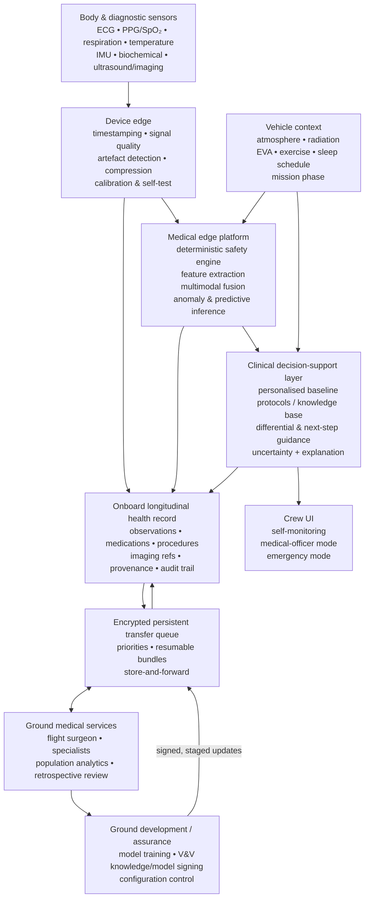
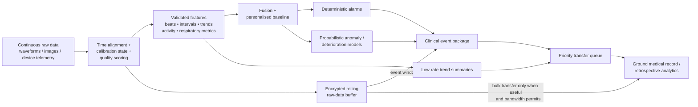
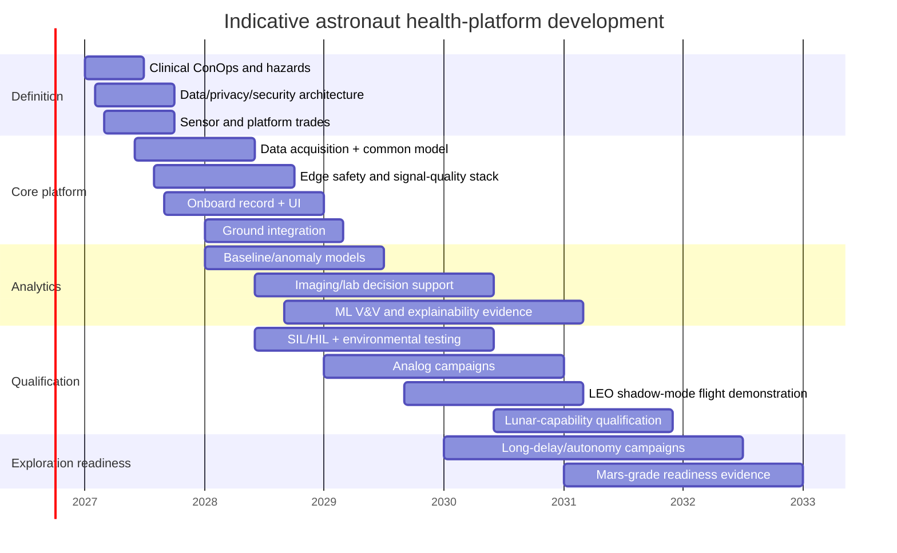

# Health Monitoring Software for Astronauts on Space Missions

## Executive summary

Astronaut health monitoring should not be designed as a wearable-data dashboard with a terrestrial cloud backend. For exploration missions, it is better understood as a **safety-critical, intermittently connected clinical information and decision-support system** spanning body-worn sensors, diagnostic equipment, spacecraft computing, medical records, crew interfaces and delayed ground expertise. NASA's own deep-space medical work makes the same architectural shift explicit: exploration requires greater crew autonomy, integrated crew-health data, and progressively less dependence on real-time terrestrial medical support; a NASA technical paper cites Mars communication delays of up to roughly 24 minutes one way and identifies mass, volume, power, bandwidth and evacuation constraints as major drivers. citeturn19view2turn18view2

The central architectural recommendation of this report is therefore an **offline-first, edge-dominant hybrid system**. Immediate signal-quality assessment, safety rules, anomaly detection, event capture and essential clinical decision support should execute onboard. Ground infrastructure should provide longitudinal review, specialist consultation, population-level analytics, model development and controlled software/model updates. As missions progress from LEO to lunar and then Mars/deep space, the partition moves steadily towards onboard autonomy. NASA's Mars medical-system concept already describes representative workflows in which an onboard system combines history, vital signs, imaging and laboratory information, generates differential diagnoses and treatment support, keeps the health record locally, and later synchronises with Earth. citeturn18view0turn22view0

The system should have **two analytically independent safety paths**. A deterministic path should handle sensor validity, physiological limits, high-confidence emergency rules and loss-of-signal conditions. A second probabilistic path can provide personalised baselines, multivariate anomaly detection and predictive risk estimates. Machine-learning output should initially be advisory, uncertainty-aware and explainable; it should not silently replace the deterministic safety path. NASA is actively investigating low-power, fault-tolerant edge AI for spaceflight hardware, while NIST's AI Risk Management Framework provides a useful, though non-certifying, framework for AI trustworthiness and test/evaluation. citeturn7search2turn12search17

The **data architecture matters at least as much as the algorithms**. Every observation should retain time, source-device identity, units, calibration state, signal-quality information, processing provenance, software/model version and uncertainty. Raw high-rate signals should normally stay onboard in rolling/event buffers; compact trends, extracted features and event snippets should be prioritised for transmission. Clinical information should map to healthcare semantics such as HL7 FHIR, imaging to DICOM, and long-delay space communications should use a store-and-forward model consistent with CCSDS Delay/Disruption-Tolerant Networking principles. FHIR explicitly supports healthcare information exchange and resources including observations and imaging studies; DICOM is the international standard for medical imaging information; CCSDS's Bundle Protocol is specifically designed for high-delay and intermittent links. citeturn13search0turn13search4turn20search5turn21search0turn21search24

Sensors should be treated as an **ensemble rather than independent truth sources**. ECG, PPG/SpO₂, respiration, temperature and IMUs are complementary: motion can explain apparent PPG abnormalities; ECG and PPG together can distinguish pulse-sensor artefact from rhythm change; respiratory, oxygenation and activity context can improve interpretation of apparent desaturation; and vehicle environmental data can distinguish individual physiology from habitat events. NASA's Mars concept explicitly envisages integration of crew medical information with vehicle/environment data, while flight research wearables such as Bio-Monitor/Astroskin already combine cardiovascular, respiratory, oxygenation, temperature and activity measurements. citeturn18view0turn5search0turn5search6

Publicly documented operational and experimental systems show that the constituent technologies exist, but not yet as one publicly demonstrated, fully autonomous, Mars-grade clinical platform. ISS medical operations include NASA's Crew Health Care System ecosystem and dedicated biomedical/flight-surgeon support; NASA is developing integrated crew-health data concepts; CSA-associated Bio-Monitor/Astroskin provides multimodal wearable monitoring; ESA has used Tempus Pro in astronaut-related medical operations and has investigated tablet-based systems such as EveryWear; and ESA's 2026 Huginn experiment includes a Danish Aerospace Company chest-worn Wearable Health Monitoring System intended to demonstrate operation in microgravity. citeturn0search26turn0search37turn19view2turn5search0turn0search7turn0search15turn18view1

For **short LEO missions**, a ground-assisted hybrid is sufficient. For the **ISS**, a balanced hybrid architecture is appropriate because strong terrestrial medical support exists. For **lunar missions**, onboard capability should become authoritative for immediate care even though ground consultation remains valuable. For **Mars**, the medical stack should remain clinically useful during prolonged communications outages and should support diagnosis, imaging, laboratory workflows and longitudinal health management without synchronous Earth interaction. For still more distant **deep-space missions**, replicated storage, graceful degradation, radiation-aware compute and autonomous maintenance become first-order architectural concerns. NASA-STD-3001 applies a human-system perspective across spacecraft, habitats and related software, while NASA's exploration medical research explicitly identifies distance from Earth as a fundamental hazard. citeturn19view3turn19view2

A realistic development programme, assuming the target spacecraft, exact sensor suite and budget remain unspecified, is **approximately 18–24 months for a non-flight or LEO technology demonstrator, three to four years for a mature lunar-capable system, and roughly five to seven years to build the evidence base expected of a Mars/deep-space clinical system**. These are programme-planning estimates rather than quoted agency costs or schedules. A Mars-grade effort would reasonably peak around **45–70 specialised full-time-equivalent staff**, plus spacecraft integration, external laboratories, clinical study participants and mission operations personnel. The dominant schedule risk is unlikely to be application coding; it will be obtaining credible medical evidence, human-factors evidence, hardware qualification, safety assurance and representative in-flight data.

The most consequential open research problem is not “which neural network?” It is **how to prove that personalised autonomous monitoring remains clinically useful, acceptably quiet, explainable, cybersecure and fault-tolerant after months or years of physiological adaptation, sensor ageing, software ageing and radiation exposure, with very little statistically independent astronaut data**. NASA's ongoing CHAPEA programme is already exploring long-duration Mars-like isolation and, in its second mission, has publicly shown demonstrations involving AI-enabled medical training and specialised health-monitoring equipment, making analog environments a valuable but incomplete bridge between laboratory testing and flight. citeturn17search5

The recommendations below are **platform-agnostic** because the requested target vehicle, processor, operating system, sensor suppliers and budget are unspecified. Resource estimates consequently have wider uncertainty than they would after a spacecraft-level concept of operations and hazard analysis.

## Mission context and design envelope

### Mission classes

Crew size primarily changes privacy, concurrent-patient handling, storage and the probability that a medically trained crewmember is themselves incapacitated. Mission duration is more important for calibration drift, electrode/wearable degradation, battery cycles, consumable expiry, changing physiological baselines and the need to maintain software without returning hardware to Earth.

The crew figures below are **reference sizing assumptions for engineering**, not commitments by NASA, ESA or any specific programme. For context, NASA's recently completed Artemis II mission flew four people for approximately ten days, while NASA's CHAPEA Mars analog uses a four-person crew; those provide useful current reference cases without implying that future Mars missions must use four people. citeturn15search6turn17search5

| Mission regime | Engineering crew envelope | Duration envelope used here | Connectivity and operations | Required medical autonomy | Recommended architectural bias |
|---|---:|---|---|---|---|
| Short LEO / commercial orbital | 2–6 | Hours to several weeks | Low propagation delay; contact may nevertheless be scheduled/intermittent | Low–moderate | Ground-assisted hybrid |
| ISS / long-duration LEO | 4–7 | Months | Mature mission-control and medical-support environment; local capability still needed for emergencies | Moderate | Balanced hybrid |
| Lunar transit / orbital / surface | ~4 nominal design point | Days to months | Seconds-scale propagation rather than Mars-scale minutes, but coverage and operational availability cannot be assumed continuously | Moderate–high | Onboard-first hybrid |
| Mars transit + surface + return | 4–6 design envelope | Roughly 2–3 years as a sizing assumption | Long and variable delay; link interruptions; evacuation may be unavailable for long periods | Very high | Edge-dominant hybrid |
| More distant deep space | 4–6 design envelope | Multi-year | Increasing delay, intermittent links and potentially severe downlink scarcity | Near-independent | Replicated autonomous edge system |

The difference between lunar and Mars architectures is therefore not merely more storage. NASA's exploration-health analysis points to one-way Mars delays as high as 24 minutes, six-to-nine-month transit intervals, limited opportunity for evacuation and tight mass/volume/power budgets; these collectively invalidate workflows in which the spacecraft waits for a ground clinician before interpretation or intervention. citeturn19view2

Artemis II also gives a useful contemporary short-lunar reference: its four-person crew completed an approximately ten-day lunar journey in April 2026. This does **not** imply that future sustained lunar operations will share its medical architecture; it demonstrates why "lunar" must be split conceptually between short sortie and longer habitat missions. citeturn15search6

### Constraint progression

| Constraint | LEO / ISS | Lunar | Mars | Deep-space consequence |
|---|---|---|---|---|
| **Latency** | Synchronous ground interaction generally feasible | Ground interaction still useful for non-immediate cases | Real-time conversational medicine becomes impractical for urgent decisions; NASA cites delays up to ~24 min one way | Ground must be advisory/asynchronous |
| **Bandwidth / availability** | Relatively favourable but still shared mission resource | More constrained and coverage-dependent | Long-delay/interruption-sensitive | Prioritised event summaries and store-and-forward mandatory |
| **Power** | Vehicle power comparatively accessible | Must compete with habitat/lander loads | Strong mass-energy penalty across the whole mission | Continuous high-power GPU processing is unattractive |
| **Compute** | Ground compute can absorb expensive analytics | More processing should move onboard | Core clinical inference must be onboard | Multiple low-power fault-containment tiers preferable |
| **Radiation / hardware reliability** | Shielding/environment more forgiving than exploration regimes | Increased concern beyond protective LEO environment | Long exposure makes fault detection and graceful degradation critical | Radiation-aware component selection and redundant state are central |
| **Autonomy** | Ground-led model viable | Shared authority | Onboard medical authority | Earth-independent care capability |
| **Maintenance** | Replacement/resupply may be possible | Limited | Hardware replacement effectively limited to carried spares | Software must diagnose itself and degrade safely |
| **Clinical ground truth** | Flight surgeons can review frequently | Delayed but available | Sparse, delayed and potentially unavailable | Algorithms must express uncertainty rather than conceal it |

The latency, autonomy and mass/power progression is explicitly reflected in NASA exploration-medical work. For the communications layer, CCSDS defines Delay-Tolerant Networking for large delays, intermittent connectivity and even periods without contemporaneous end-to-end paths; Bundle Protocol uses persistent store-and-forward routing, which is a natural match for non-urgent medical records, imaging and algorithm audit packages. citeturn19view2turn21search0turn21search24

NASA's low-power SC-LEARN research illustrates a relevant compute direction: edge AI combined with fault-tolerant modes, cold-spare/power-saving operation and planned radiation testing. It is not a medical device architecture, but it demonstrates that low-power resilient onboard ML is an active spacecraft-computing research area. citeturn7search2

### What changes with duration

For **short missions**, monitoring can rely heavily on pre-flight baselines, modest history storage and terrestrial follow-up. The principal challenge is rapid event detection without burdening the crew.

For **months-long missions**, physiological adaptation means fixed terrestrial thresholds become less informative. The system should distinguish population safety bounds from personalised trend baselines and maintain an explicit history of exercise, sleep, EVA, medication and environmental context. NASA-STD-3001 treats crew health and human-system performance across the mission lifecycle and explicitly covers software and equipment with which crews interact. citeturn0search0turn19view3

For **multi-year missions**, calibration state, device ageing, consumable shelf life, model drift, software migration and knowledge-base currency become medical safety issues. NASA's integrated-data-architecture work argues that combining crew-health and performance information is critical for reducing uncertainty and enabling greater medical autonomy rather than simply transferring today's ground-centred workflow to a distant spacecraft. citeturn18view2turn19view2

## Reference software architecture and analytics

### Architectural alternatives

| Architecture | Strengths | Weaknesses | Best fit | Overall assessment |
|---|---|---|---|---|
| **Ground/cloud-centric** | Maximum compute; easy specialist access; simpler flight hardware; easy population-model updates | Communications dependency; privacy exposure; poor emergency behaviour; unsuitable for long latency | Short LEO demonstrations | Acceptable only when a local safety layer exists |
| **Fully onboard / edge-only** | Lowest decision latency; maximum autonomy and privacy; survives loss of Earth link | Flight compute/power constraints; harder updates; limited specialist review; more qualification burden | Contingency mode, very distant missions | Useful end-state but unnecessarily restrictive as the sole architecture |
| **Hybrid, ground-biased** | Edge alarms plus sophisticated ground analysis | Ground still becomes operational dependency for sophisticated care | LEO/ISS | Recommended for near-Earth operations |
| **Hybrid, edge-biased** | Local record, fusion, CDS and analytics; asynchronous ground support | More flight software and V&V; configuration synchronisation becomes difficult | Lunar/Mars | **Recommended exploration baseline** |
| **Federated replicated hybrid** | Edge-biased system plus redundant onboard nodes, durable event log, delayed replication and knowledge/model packages | Highest complexity and assurance cost | Mars / multi-year deep space | **Recommended where Earth cannot be part of the immediate safety loop** |

NASA's Mars medical concept strongly supports the edge-biased direction. Its representative autonomous care workflow includes local history collection, automatic vital-sign ingestion, differential diagnosis, guided ultrasound, laboratory interpretation, contraindication checking and later ground synchronisation. The report explicitly notes that the depicted technologies are representative rather than programme requirements, so it should be used as architectural evidence, not treated as a procurement specification. citeturn18view0turn22view0

### Recommended logical architecture



The onboard record should remain the authoritative copy for **current onboard care** during an outage, while record synchronisation to Earth should be conflict-aware and auditable. That model is consistent with NASA exploration-medical concepts and with CCSDS's persistent, asynchronous store-and-forward communications model. citeturn18view0turn21search0

A practical implementation should separate four compute domains:

**Device tier.** Sensor microcontrollers perform timestamping, impedance/contact checks where available, simple artefact rejection and lossless or clinically acceptable compression.

**Medical edge tier.** A fault-contained onboard node performs deterministic alarms, feature extraction, sensor fusion and validated ML inference. The safety path should not require a general-purpose cloud service.

**Vehicle clinical-services tier.** This maintains the longitudinal record, permissions, audit log, procedure library, imaging catalogue and model/configuration registry.

**Ground tier.** Ground systems run computationally expensive retrospective analytics, cohort comparisons, algorithm development, specialist imaging review and controlled release of updated models. NASA's own integrated-data work identifies a unified architecture as an enabler for automated clinical decision making and reduced reliance on ground guidance. citeturn18view2turn19view2

### Data pipeline and data-volume funnel

The key bandwidth strategy is **analyse continuously, transmit selectively**. High-rate raw data have significant diagnostic value but do not all need immediate downlink. Event windows and sufficient provenance should be retained so that an onboard conclusion can later be independently reconstructed.



Every observation should carry, at minimum, a monotonic/event timestamp and mission time, patient identifier, source-device/channel identifier, units, sampling characteristics, calibration/version information, signal-quality state and processing provenance. Derived features should additionally identify the algorithm/model version that generated them. Those requirements are architectural recommendations, but interoperability can be grounded in established healthcare standards: FHIR defines a framework for exchanging healthcare information and includes resources for observations, reports and imaging metadata; DICOM addresses medical imaging storage, exchange and display. citeturn13search0turn13search4turn20search5

For flight telemetry, FHIR JSON should **not** automatically be assumed to be the most efficient wire format. A sensible design is compact flight-native binary telemetry internally, mapped losslessly into FHIR-compatible clinical objects at the record boundary. Images should retain DICOM-compatible metadata even when the spacecraft uses mission-specific compression or transfer encapsulation. This preserves clinical semantics without forcing terrestrial enterprise-healthcare protocols into every sensor microcontroller.

### Real-time analytics and anomaly detection

Three layers should be used.

**Signal integrity precedes medicine.** Algorithms should first ask whether a measurement is trustworthy: electrode disconnected, PPG saturation, motion contamination, optical contact loss, timing discontinuity, impossible temperature derivative, IMU clipping or biochemical cartridge-control failure. A low-quality observation should generally produce a *sensor-quality* condition, not a physiological emergency.

**Deterministic clinical guardrails come next.** Validated thresholds, change limits, protocol rules and cross-sensor plausibility checks should retain their own independently testable execution path. Thresholds can include both absolute safety bounds and crew-specific relative-change rules.

**Statistical/ML analytics augment the guardrails.** Appropriate applications include personalised-baseline deviation, multivariate change-point detection, artefact classification, sleep/activity inference, risk scoring, deterioration forecasting, imaging guidance and prioritisation of data for downlink. NASA's Mars concept specifically anticipates onboard image interpretation, vital-sign synthesis and differential-diagnosis support, while its broader exploration research calls for integrated predictive/detection/analysis capabilities. citeturn18view0turn19view2

For a crew of only a few people, models should usually estimate **change from the individual's own trajectory**, not merely apply an Earth-population classifier. Useful model families include Bayesian/state-space models, robust multivariate distance/change detectors, calibrated logistic or survival models, small gradient-boosted models and carefully bounded neural models for waveform/image tasks. The recommendation is not to prohibit deep learning, but to reserve complexity for cases where validation evidence justifies it.

Continuous online learning in a high-consequence medical path is undesirable as the default. A safer configuration is a **locked in-flight model** with monitored input and performance drift, followed by separately validated, cryptographically signed releases. Models may adapt low-risk parameters such as a baseline distribution within pre-defined bounds without changing the decision policy itself.

### Explainability and uncertainty

An alert should answer five questions directly:

1. **What changed?**
2. **Relative to which baseline or limit?**
3. **Which sensors support the conclusion?**
4. **How trustworthy are those sensors and the model output?**
5. **What should the crew do next?**

A useful explanation is therefore closer to:

> “Resting heart rate has remained 18% above this crewmember's 14-day baseline for 45 minutes; ECG and PPG agree, signal quality is high, activity is low, and temperature is also increasing.”

than to:

> “Anomaly score = 0.83.”

For complex models, feature-attribution techniques may be useful debugging aids, but post-hoc explainability alone is not evidence of clinical validity. NIST's AI RMF emphasises managing AI risk through governance, measurement, testing and evaluation; it does not constitute certification of a medical algorithm. citeturn12search17

### Cybersecurity and privacy

The health system should be segmented from vehicle-control networks so that compromise of a wearable or medical tablet cannot create a direct path to propulsion, guidance or life-support commands. CCSDS work explicitly addresses authentication/encryption at the space-link layer, but application security still requires independent end-to-end controls. citeturn21search24

Recommended controls include secure boot; measured/signed firmware and model packages; mutual authentication; least privilege; encrypted data at rest and in transit; hardware-backed keys where supported; signed configuration; anti-rollback protections; tamper-evident audit records; software bills of materials; dependency/version inventory; offline credential and key-rotation procedures; redundant recovery images; and “break glass” emergency access that is logged but cannot be blocked by unavailable Earth services.

Medical data should have finer access control than ordinary mission telemetry. A crew member needs access to their own relevant information; a crew medical officer may need broader emergency access; flight surgeons require longitudinal clinical information; researchers do not necessarily require identifiable operational records. Clinical care and research consent should therefore be represented as separate policy domains rather than a single “astronaut data” permission.

For programmes handling EU residents' health data, privacy design may also intersect with EU data-protection law and the European Health Data Space. The EHDS Regulation entered into force in March 2025 and establishes a phased framework around electronic health data, interoperability, security and secondary use alongside existing EU data-protection rules. Applicability to a multinational space programme depends on controller, processor, jurisdiction and purpose and should therefore be determined by programme counsel rather than assumed from spacecraft ownership. citeturn5search16

## Sensors, fusion and device reliability

### Comparative sensor matrix

| Modality | Primary health information | Advantages | Space/operational failure modes | Recommended software treatment |
|---|---|---|---|---|
| **ECG** | Heart rate, rhythm, beat morphology, HRV-derived features | Direct cardiac electrical measurement; useful cross-check for optical pulse sensing | Lead-off, contact changes, motion artefact, electrode degradation | Continuous lead-quality checks; beat confidence; retain event waveform |
| **PPG** | Pulse waveform, pulse rate, perfusion-related metrics | Low-power, wearable-friendly | Motion, pressure/contact, optical saturation, peripheral perfusion changes | Fuse with ECG/IMU; quality index before inference |
| **SpO₂** | Arterial oxygen-saturation estimate | Valuable for hypoxia/respiratory assessment | Motion, low perfusion, optical/interface effects and calibration limitations | Trend + confidence; corroborate with respiration/activity/environment |
| **Respiration** | Rate, rhythm, relative effort | Important for cardiopulmonary monitoring and sleep/exercise context | Belt/garment movement, placement changes, motion coupling | Cross-check ECG/PPG respiratory modulation and IMU context |
| **Skin temperature** | Thermal trend | Simple, low-power, long duration | Strong local/environmental effects; not interchangeable with core temperature | Personal baseline + ambient/context metadata |
| **Core-temperature device** | Thermal strain / fever-related information | More clinically interpretable for some decisions | More intrusive or consumable-dependent depending modality | Use only with modality-specific validated limits |
| **IMU / motion** | Activity, posture, exercise load, falls/impact, tremor proxies | Tiny, low power; valuable context for every physiological channel | Sensor bias, mounting orientation, clipping | Calibration/orientation tracking; use as artefact/context channel |
| **Blood pressure** | Haemodynamic state | High clinical value | Cuff burden; technique sensitivity; continuous methods require validation | Store method and calibration context with every reading |
| **Biochemical blood/urine** | Electrolytes, blood counts, biomarkers, urinalysis etc., depending instrument | Can resolve conditions that vital signs cannot | Reagent life, contamination, calibration, consumables, fluid handling | Cartridge QC, lot/expiry traceability, controls, uncertainty |
| **Ultrasound** | Cardiac, vascular, abdominal, musculoskeletal and procedural imaging | Very broad diagnostic capability without ionising imaging hardware | Operator skill and image-quality dependence | Onboard acquisition guidance, image-quality scoring, DICOM metadata, delayed expert review |
| **Camera / optical imaging** | Skin, eye, oral/dental, wounds, behavioural/functional observations | Low hardware burden | Lighting, colour calibration, privacy | Controlled illumination/calibration and explicit consent/access rules |
| **Molecular/genomic analysis** | Pathogen identification / molecular characterisation | High diagnostic/research potential | Sample preparation, contamination, compute and interpretation burden | Episodic workflow; rigorous sample provenance rather than continuous monitor |

Flight wearables already demonstrate the practicality of combining several rows in one garment. NASA's Life Sciences Data Archive describes the Bio-Monitor shirt as measuring breathing, oxygenation, temperature and cardiovascular-related variables; Hexoskin/Astroskin describes synchronised ECG, respiration, SpO₂, skin temperature and motion sensing. Those sources demonstrate technical capability, not equivalence to a certified autonomous clinical monitor. citeturn5search0turn5search6

Space-based molecular diagnostics are also more than hypothetical: nanopore DNA sequencing has been demonstrated in microgravity in published flight research. Its importance here is principally architectural—it shows that high-dimensional biomedical analysis can occur onboard—rather than evidence that sequencing should be continuously incorporated into routine vital-sign monitoring. citeturn7search15

### Sensor fusion

A robust fusion engine should maintain **both a physiological state estimate and a sensor-health state estimate**.

For example:

```text
Observed low SpO₂
        |
        +-- PPG quality poor + high IMU motion
        |       -> likely artefact; reacquire / reposition
        |
        +-- PPG quality good + respiration abnormal
        |       -> clinical alert candidate
        |
        +-- several crew affected simultaneously
        |       -> check habitat atmosphere/environment first
        |
        +-- ECG abnormal + symptoms reported
                -> escalate clinical workflow
```

NASA's exploration concept specifically includes access to vehicle environmental history during medical evaluation and, in radiation scenarios, envisages integrating radiation/environment data with biosensor information. This is a strong reason not to architect crew-health monitoring as an isolated wearable platform. citeturn18view0

Fusion should generally happen in stages:

**Syntactic fusion** aligns clocks, units and identifiers.

**Quality fusion** determines which channels are currently usable.

**Feature fusion** combines validated beat, respiration, temperature and activity variables.

**Clinical-context fusion** adds medication, sleep, EVA, exercise, habitat and mission-phase information.

**Decision fusion** combines independent detectors and explicitly handles disagreement.

The system should never silently average disagreeing sensors into an apparently precise number. Disagreement is itself information and may indicate a device fault, placement problem or unusual physiology.

### Calibration and fault tolerance

Each sensor should expose a machine-readable state such as:

`VALID → DEGRADED → SUSPECT → FAILED → RECALIBRATING`.

Calibration records should include the reference used, time, technician/crew action, coefficients, firmware and expected re-verification interval. Consumable assays additionally require lot, expiry, storage exposure and control-result provenance.

Fault tolerance should use diversity rather than indiscriminate duplication. Two identical PPG sensors exposed to the same motion mechanism are less valuable than PPG plus ECG plus IMU. Likewise, two copies of an algorithm running on the same corrupted input do not create meaningful diagnostic redundancy.

For long missions the software should support:

- cross-channel plausibility checks;
- stuck-at and implausible-rate-of-change detectors;
- missing-data-aware inference;
- automatic isolation of a failing sensor;
- fall-back operating modes;
- spare-device commissioning without re-installing the entire medical stack;
- local self-test and calibration instructions;
- raw-data retention around every sensor-state transition.

### Human factors, UI and alert burden

NASA-STD-3001 Volume 2 explicitly covers human-system integration, cognitive/physical capabilities and the hardware and software with which crews interact, so alert design is a mission-safety topic rather than cosmetic user-interface work. citeturn18view3turn0search12

The user interface should expose different operational views rather than one dense clinical dashboard:

| Mode | User | UI emphasis |
|---|---|---|
| **Routine self-monitoring** | Individual astronaut | Trends, wear/sensor status, scheduled measurements; almost no nuisance alerts |
| **Crew medical mode** | Medical officer / designated caregiver | Multimodal timeline, differential-support data, medications, procedures, imaging |
| **Emergency mode** | Any trained crewmember | Large prioritised actions, current vital state, procedure guidance, minimal navigation |
| **Ground clinical mode** | Flight surgeon/specialists | Longitudinal history, raw-event review, cohort/reference analysis, audit/provenance |
| **Engineering mode** | Biomedical/avionics support | Device health and telemetry without unnecessary access to clinical narrative |

Alerts should be stateful rather than repeatedly triggered threshold messages. A good alarm manager should group correlated findings into one clinical episode, suppress downstream symptoms of an already acknowledged event, state data quality, and distinguish **“sensor requires attention”** from **“crewmember requires attention”**.

NASA's Mars concept is notable in this respect: it repeatedly presents the medical system as prompting and guiding the caregiver, recording actions and allowing the caregiver to review or disagree with machine interpretation rather than simply emitting diagnoses. citeturn18view0

## Existing systems, vendors, standards and governance

### Systems and commercial landscape

The table deliberately distinguishes **operational use**, **research/technology demonstration** and **architectural concept**. Those categories should not be collapsed into a single “space-qualified vendor” list.

| Organisation / system | What is publicly documented | Maturity relevant to this report | Key architectural lesson |
|---|---|---|---|
| **NASA – ISS Crew Health Care System / biomedical operations** | NASA biomedical flight controllers support ISS crew health, medical operations and CHeCS-related hardware; ISS health logistics have included electronic inventory tracking. citeturn0search26turn0search37 | Operational ecosystem | Space medicine is a socio-technical system combining crew, hardware, ground clinicians and logistics—not one app |
| **NASA – Crew Health and Performance Integrated Data Architecture work** | NASA research describes an integrated information architecture intended to combine crew health/performance data and support automated clinical decision making with less reliance on ground. citeturn18view2turn19view2 | R&D / architecture | Data integration and autonomy should be first-class requirements |
| **NASA – Mars Medical System Concept of Operations** | Representative workflows include automated vital-sign ingestion, guided imaging, laboratory interpretation, differential diagnosis and delayed record synchronisation. citeturn18view0turn22view0 | Concept / requirements research | Excellent reference for autonomous clinical workflow, but not a flight product |
| **CSA-associated Bio-Monitor / Carré Technologies Hexoskin-Astroskin** | Multimodal garment monitoring includes ECG/cardiovascular, respiration, SpO₂, temperature and activity-related sensing. citeturn5search0turn5search6 | Flight research / commercial wearable technology | Demonstrates unobtrusive synchronised multi-sensor acquisition |
| **ESA/CNES EveryWear** | ESA's Proxima programme publicly documents EveryWear among astronaut health/science tools. citeturn0search7 | Flight experiment/application heritage | Tablet-based integration can reduce crew-interface fragmentation |
| **Philips / Remote Diagnostic Technologies – Tempus Pro** | ESA documented Tempus Pro in astronaut health/recovery contexts and noted RDT's acquisition by Philips. citeturn0search3turn0search15 | Portable clinical/telemedicine equipment with space-operation heritage | Commercial medical equipment can be adapted, but terrestrial telemedicine assumptions must be removed for Mars |
| **Danish Aerospace Company – Wearable Health Monitoring System** | ESA's 2026 Huginn experiment describes a chest-worn WHMS intended to verify operation in microgravity during routine activity/exercise, with launch/landing monitoring desired. citeturn18view1 | 2026 in-flight technology demonstration | Commercial-space wearables still require environment-specific evidence |
| **NASA CHAPEA medical/AI demonstrations** | CHAPEA Mission 2 is a four-person Mars analog; NASA has publicly shown specialised health-monitoring and AI-enabled medical-training activities in the habitat. citeturn17search5 | Ground analog research | Useful environment for workload, autonomy and delayed-support testing before flight |

This market is consequently **fragmented by layer**. Wearable suppliers provide sensors; medical-device companies provide diagnostic instruments; agencies provide operational medical systems and integration; spacecraft programmes provide flight compute/communications; and autonomous exploration medicine remains predominantly an agency/R&D integration problem. Public evidence is much thinner for a commercial vendor offering a complete, clinically validated, Mars-autonomous stack.

### Standards and regulatory framework

There is no single universal certificate called “space medical software certification”. A mission system can simultaneously be subject to programme human-rating/safety rules, software assurance, medical-device requirements for constituent products, information-security controls, interoperability standards and jurisdiction-specific privacy obligations.

| Framework | Relevance | How to use it |
|---|---|---|
| **NASA-STD-3001 Vol. 1** | Agency-level crew-health and medical requirements for NASA human spaceflight. citeturn0search0turn0search8 | Top-level health/safety requirements and medical capability allocation |
| **NASA-STD-3001 Vol. 2** | Human factors, habitability/environmental health and interfaces between people and systems, including relevant software. citeturn19view3turn0search12 | UI, human-system integration, workload, maintainability and operational design |
| **NASA NPR 7150.2 / Software Engineering Handbook** | NASA's software engineering procedural baseline and implementation guidance for reliable flight/mission software. citeturn4search0 | Requirements traceability, software lifecycle, configuration control and assurance baseline for NASA implementation |
| **ISO 14971:2019** | International medical-device risk-management framework covering lifecycle hazard identification, risk evaluation/control and residual-risk monitoring. citeturn20search2 | Maintain a medical-device-style risk file even when programme rules, rather than a regulator, are the immediate authority |
| **FDA medical-device / digital-health framework** | FDA regulates medical devices placed on the US market and maintains digital-health guidance covering software and AI/ML topics. citeturn20search20 | Determine applicability from intended use and commercialisation pathway; do not treat FDA status as equivalent to spacecraft qualification |
| **HL7 FHIR** | Standardised electronic exchange of healthcare information; includes observation/report/imaging-related resources. citeturn13search0turn13search4 | Canonical clinical semantics and ground-system interoperability |
| **DICOM** | International medical-imaging information standard. citeturn20search5 | Ultrasound/optical diagnostic image metadata, archival and ground review |
| **CCSDS DTN / Bundle Protocol** | Designed for delay, disruption and lack of contemporaneous end-to-end connectivity. citeturn21search0turn21search24 | Medical record, audit, imaging and model-package transfer for exploration links |
| **CCSDS link security work** | CCSDS develops authentication/encryption mechanisms for space links. citeturn21search24 | One layer of defence; supplement with medical application identity, encryption and access control |
| **NIST AI RMF** | Voluntary framework for trustworthy/responsible AI risk management and TEVV. citeturn12search17 | Governance, model evidence, uncertainty, monitoring and change control; not a medical certificate |
| **EU EHDS / GDPR-related health-data regime** | EHDS entered force in 2025 and phases in rules for electronic health-data access, interoperability/security and secondary use alongside EU privacy law. citeturn5search16 | Relevant where programme organisations/data processing fall within European jurisdiction |

The key certification principle is to **freeze intended use before selecting the assurance route**. Software that merely records an astronaut's heart rate is a different risk object from software that tells an untrained crewmember to administer medication during an autonomous Mars emergency.

The programme should maintain a requirements-to-evidence graph:

```text
Hazard
  ↓
Safety requirement
  ↓
Software / sensor requirement
  ↓
Design element
  ↓
Verification method
  ↓
Test evidence
  ↓
Clinical validation evidence
  ↓
Residual risk / operational constraint
```

This prevents the common failure mode in AI systems where a high-performing model is validated statistically but no one can demonstrate which top-level medical hazard its test set actually controls.

### Selected primary research base

Particularly useful source material for an engineering team includes:

- NASA's **Medical System Concept of Operations for Mars Exploration Missions**, because it describes autonomous and semi-autonomous clinical workflows involving vital signs, imaging, laboratory analysis, clinical decision support and record synchronisation. citeturn18view0turn22view0
- NASA's work on **development of medical capabilities and integrated crew-health data architecture**, which explicitly links integrated information to autonomous decision making and reduced ground reliance. citeturn18view2turn19view2
- NASA work on **digital twins/living models**, where continuously ingested data update models of system state; this is relevant to personalised health-state estimation, although translating an engineering digital-twin concept into a validated clinical twin remains an open research problem. citeturn11search29
- Flight research demonstrating **nanopore sequencing in microgravity**, relevant to future autonomous molecular diagnostics. citeturn7search15
- Current wearable flight research such as **Bio-Monitor/Astroskin** and ESA/DAC's WHMS demonstrations, relevant to continuous multimodal acquisition. citeturn5search0turn5search6turn18view1
- NASA's **SC-LEARN** low-power/fault-tolerant edge-AI research, relevant to the compute architecture even though it is not itself a medical system. citeturn7search2

The evidence base therefore supports the major components individually much more strongly than it supports a single end-to-end autonomous medical AI. That distinction should drive programme claims and verification language.

## Recommended architectures by mission type

### Short LEO missions

**Recommended pattern: ground-assisted hybrid with a small mandatory edge safety kernel.**

Onboard:

- acquisition, timestamping and signal-quality assessment;
- deterministic alarms;
- a few validated anomaly models;
- encrypted rolling waveform buffer;
- local emergency health summary;
- operation through complete temporary communications loss.

Ground:

- long-term record;
- richer analytics;
- clinician review;
- model training and retrospective analysis.

This minimises qualification mass while ensuring that losing the communications link does not also eliminate emergency monitoring. The architecture is compatible with current LEO practice in which substantial biomedical expertise resides in mission control. NASA's biomedical flight-controller model illustrates how extensively ISS operations can use dedicated ground medical support. citeturn0search26

### ISS and long-duration LEO

**Recommended pattern: balanced hybrid with richer longitudinal onboard state.**

Compared with short LEO, keep several days to weeks of diagnostically useful raw/event data onboard; integrate wearable, exercise, sleep and clinical observations; maintain a synchronised local health record; and perform personalised-baseline analytics onboard.

The ground should still perform high-compute analysis and specialist interpretation because the communications/operations environment makes that efficient. CHeCS and ISS biomedical operations demonstrate the mature ground-supported medical ecosystem available in this regime. citeturn0search26turn0search37

Machine learning should initially run in **shadow or advisory mode** against current medical operations so false positives, missed events, user behaviour and physiological adaptation can be measured without giving the model clinical authority.

### Lunar missions

**Recommended pattern: onboard-first hybrid.**

The system should remain fully useful for acute monitoring while disconnected from Earth. In addition to the ISS feature set, lunar missions should carry:

- autonomous procedure guidance;
- onboard imaging acquisition assistance;
- local medication/contraindication data;
- stronger local record authority;
- event-driven imaging and waveform transfer;
- pre-positioned ground-consult packages;
- fault-contained redundant compute for medical essentials.

The recently completed four-person, roughly ten-day Artemis II flight shows the short-mission end of the lunar spectrum, but sustained lunar habitation will place far greater demands on calibration, medical history and autonomous troubleshooting. citeturn15search6

A lunar design should deliberately serve as the **qualification bridge to Mars**: the interfaces and data model should be Mars-compatible even when the lunar mission does not require full Mars autonomy.

### Mars

**Recommended pattern: autonomous medical edge platform with asynchronous Earth expertise.**

The Mars health system should be capable of performing the core clinical workflow without ground:


This closely resembles the class of autonomous workflow NASA has already studied for Mars, including automated collection of vital signs, ultrasound guidance/interpretation, laboratory analysis and deferred ground synchronisation. citeturn18view0turn22view0

I recommend that the Mars deployment include:

**A deterministic clinical safety kernel.** Small, highly verified, independently deployable and able to run on conservative flight compute.

**A probabilistic personalised-health service.** Multivariate baselines, anomaly ranking, deterioration prediction, signal-quality analytics and treatment-response monitoring.

**An autonomous clinical knowledge service.** Version-controlled protocols, medication information, diagnostic workflows and training content available without Earth.

**Local imaging and laboratory support.** Automated quality checks and acquisition guidance, with machine interpretation treated according to validated intended use.

**A replicated longitudinal record.** No external network dependency for authentication or retrieval.

**Durable DTN synchronisation.** Priority classes should distinguish emergency summaries from ordinary trends, research data and bulk raw archives, using store-and-forward semantics consistent with CCSDS exploration networking. citeturn21search0turn21search24

### Beyond Mars / very long deep space

**Recommended pattern: Mars architecture plus fault survival and autonomous maintenance.**

The major difference is not a novel analytics algorithm. It is assumption removal:

- do not assume a particular Earth service is reachable;
- do not assume replacement hardware;
- do not assume ground can resolve a database conflict;
- do not assume a model can be frequently updated;
- do not assume the highest-performance compute node will remain operational;
- do not assume the medically trained person is available.

Therefore, critical functions should have **multiple executable degradation levels**. If the AI accelerator fails, ECG processing and safety rules should continue on conservative processors. If imaging assistance fails, manual protocols and reference imagery must still be available. If the primary health database is damaged, a second immutable/event-sourced replica should reconstruct essential history.

NASA's space-edge-computing research into fault-tolerant and low-power AI modes supports this general resilience direction, while CCSDS DTN supports the corresponding communications assumptions. citeturn7search2turn21search0

### Mission-by-mission decision matrix

| Capability | Short LEO | ISS | Lunar | Mars | Deep space |
|---|---|---|---|---|---|
| Local deterministic alarms | **Mandatory** | **Mandatory** | **Mandatory** | **Mandatory** | **Mandatory** |
| Local raw ring buffer | Hours | Days | Days–weeks | Weeks + selected archive | Weeks + replicated archive |
| Local longitudinal EHR | Minimal/emergency | Yes | **Authoritative during outages** | **Authoritative** | **Authoritative + replicated** |
| Personalised baselines | Useful | Recommended | Strongly recommended | **Core capability** | **Core capability** |
| Ground specialist required for routine interpretation | Often acceptable | Often acceptable | No | **No** | **No** |
| Local ultrasound guidance | Optional | Useful | Recommended | **Strongly recommended** | **Strongly recommended** |
| Local lab interpretation | Limited | Useful | Recommended | **Core** | **Core** |
| Predictive ML | Shadow/advisory | Advisory | Advisory/validated use | Validated decision support | Validated decision support |
| Continuous online model learning | No | Research only | No for clinical path | No for clinical path | No for clinical path |
| DTN/store-and-forward | Nice-to-have | Useful | Recommended | **Mandatory** | **Mandatory** |
| Redundant medical compute | Basic | Basic | Recommended | **Mandatory** | **Multi-level degradation** |
| Ground/cloud dependency | High tolerance | Moderate tolerance | Low tolerance | **None for acute care** | **None** |

The bold entries are recommendations from this analysis rather than current programme requirements.

## Delivery roadmap, validation, risks and research agenda

### Implementation roadmap and resource estimate

Because budget and target computing platform are unspecified, the following estimate assumes development of a reusable software platform plus reference sensor integrations, not creation of every medical sensor from first principles.

A credible Mars-oriented programme should plan on **five to seven years** of staged development and evidence collection. A LEO MVP can emerge much earlier.



Dates are illustrative, assuming programme start in early 2027; they are not NASA/ESA schedules.

A **LEO technology demonstrator** could reasonably require about 15–25 core FTE over 18–24 months. A **flight-qualified lunar-capable platform** is more plausibly a 30–45 FTE core effort over roughly three to four years. A **Mars/deep-space programme** should expect roughly 45–70 core FTE at peak over five to seven years, excluding spacecraft-wide avionics teams, launch provider personnel, independent certification/assurance organisations and external clinical trial/analog participants.

A representative peak Mars-grade team would look approximately like this:

| Discipline | Approximate peak FTE | Key skills |
|---|---:|---|
| Systems / mission / product architecture | 4–6 | ConOps, MBSE, spacecraft interfaces, requirements, safety |
| Flight medicine / clinical science | 5–8 | Aerospace medicine, emergency medicine, physiology, clinical protocols |
| Biomedical / sensor engineering | 5–8 | ECG/PPG, electronics, calibration, wearables, medical instrumentation |
| Embedded / flight software | 8–12 | RTOS/Linux as selected, C/C++, safety architecture, device drivers |
| Data platform / backend | 5–8 | Event streaming, databases, FHIR/DICOM mapping, synchronisation |
| ML / signal processing / data science | 5–8 | Biomedical DSP, time series, imaging, uncertainty, calibration |
| V&V / software assurance / safety | 7–12 | Independent test, hazard analysis, requirements traceability, coverage |
| Human factors / UX | 3–5 | Alarm design, clinical UI, workload studies, usability |
| Cybersecurity / privacy | 3–5 | Embedded security, PKI, threat modelling, health-data governance |
| DevSecOps / ground infrastructure / SRE | 3–6 | Reproducible builds, signed releases, observability, offline deployment |

These are resource-planning estimates and categories overlap; summing every upper bound would overstate a normal core team because specialists move between phases. Hardware qualification labs, radiation facilities and analog-mission operations would add external resources rather than permanent software FTE.

### Validation and testing strategy

NASA software and human-spaceflight standards make verification and human-system integration explicit programme concerns; the medical-device risk-management discipline of ISO 14971 provides a complementary way to connect hazards to controls and residual risk. citeturn4search0turn19view3turn20search2

A six-layer validation strategy is recommended.

#### Bench and algorithm verification

Every sensor channel should be tested against traceable simulators or reference equipment across expected amplitude, frequency, contact quality, battery state and temperature envelopes. Test cases should include lead loss, saturation, clipped ADCs, timestamp resets, packet duplication, out-of-order packets and gradual drift.

Signal-processing code should have known-answer vectors. Critical deterministic algorithms should produce bit-reproducible outputs where practical.

For ML, separate **verification** (“does the implementation execute the specified model?”) from **clinical validation** (“does the model make clinically useful predictions in the target population and environment?”).

#### Software-in-the-loop and hardware-in-the-loop

Simulation should inject complete clinical episodes rather than isolated sensor values:

```text
crew activity
 + vehicle environment
 + physiological state
 + sensor artefacts
 + network behaviour
 + compute faults
             ↓
      full flight stack
             ↓
 alert / decision / UI / record / downlink
```

Fault campaigns should vary packet loss, link outage, delayed clock synchronisation, corrupt records, unavailable model files, reboot during a clinical encounter, storage exhaustion, stale calibration, database replica divergence and failed software updates.

Hardware-in-the-loop should use the actual processor architecture or a flight-representative target. Radiation and single-event effects should be addressed through the programme's hardware assurance plan rather than assumed to be solved by software. NASA's edge-AI research explicitly incorporates fault-tolerance modes and radiation testing as development concerns. citeturn7search2

#### Human clinical simulation

Run clinicians and non-clinician crew surrogates through scenarios such as:

- asymptomatic sensor failure;
- exercise-induced physiological changes;
- sleep deprivation;
- respiratory compromise;
- arrhythmia;
- dehydration;
- infection;
- traumatic bleeding;
- decompression/hypoxia;
- radiation-event follow-up;
- ultrasound-guided examination;
- simultaneous patient and communications failure.

NASA's Mars ConOps is particularly useful for defining such scenarios because it models both routine and unplanned autonomous/semi-autonomous clinical encounters, including cases where the onboard system guides less-specialised caregivers. citeturn18view0

Primary human-factors measures should include time to recognise the situation, correct action sequence, procedure completion rate, false-alarm acknowledgement burden, time spent navigating, need for help, comprehension of uncertainty and trust calibration—not merely user satisfaction.

#### Analog missions

Use at least two types of analog: shorter highly instrumented campaigns for rapid iteration, and long isolation/delay campaigns for autonomy and workload.

NASA's CHAPEA Mission 2 is especially relevant because it is a four-person Mars isolation analog and NASA has publicly documented both AI-enabled medical training and testing of specialised medical-monitoring equipment inside the habitat. citeturn17search5

Analog campaigns should deliberately impose communications delay/outage. A ground clinician must not be allowed to “rescue” a supposedly autonomous workflow through an off-protocol instant message, because doing so invalidates the operational experiment.

#### In-flight shadow mode

Before granting algorithmic clinical authority, fly the system in **shadow mode**:

1. collect flight sensor data;
2. generate predictions without presenting actionable recommendations to crew;
3. compare outputs against flight-surgeon adjudication and operational records;
4. quantify false alarms, missed clinically relevant states, uncertainty calibration and sensor-failure behaviour;
5. update the model on Earth;
6. repeat with a frozen candidate release.

ISS/LEO is the logical early flight environment because current biomedical operations provide a robust ground reference. NASA's ISS biomedical controllers already plan, facilitate and monitor crew-health and medical operations. citeturn0search26

#### Staged clinical authority

Authority should grow function-by-function, not through a single “AI approved” milestone.

A possible sequence is:

**Stage A:** acquisition and visualisation only.

**Stage B:** signal-quality and device-fault alerts.

**Stage C:** advisory anomaly detection.

**Stage D:** protocol recommendations requiring crew-clinician confirmation.

**Stage E:** constrained autonomous action in explicitly pre-authorised emergencies.

The evidence requirement should increase sharply between each stage.

### ML validation plan

Biomedical ML should be evaluated on **independent humans and independent mission periods**, not random waveform segments from the same astronaut appearing in both training and test sets.

Required analyses should include:

- subject-level holdout;
- temporal holdout to expose physiological drift;
- external/device holdout where multiple sensor revisions exist;
- missing-modality testing;
- realistic motion/artefact corruption;
- calibration of predicted probabilities;
- out-of-distribution detection;
- performance by relevant physiological/anthropometric subgroups;
- false alarms per crew-day, not only AUROC;
- time-to-detection;
- failure under sensor disagreement;
- ablation to show whether each sensor meaningfully contributes;
- human comparison and human-plus-AI comparison.

A highly accurate classifier can still be operationally unusable if it emits frequent nuisance alerts. The primary safety analysis therefore needs both **false-negative harm** and **attention cost**.

Model releases should include immutable training-data lineage, code commit, feature definitions, hyperparameters, evaluation report, intended-use statement, contraindicated uses, expected input distributions and cryptographic identity. NIST's AI RMF is useful for structuring this governance and TEVV discipline, though it does not substitute for mission or medical-device assurance. citeturn12search17

### Principal programme risks

| Risk | Why it matters | Mitigation / programme gate |
|---|---|---|
| **Too little independent astronaut data** | Overfitting can look excellent in conventional cross-validation | Pre-train on terrestrial data, validate by subject, then collect shadow-mode flight evidence before clinical authority |
| **Physiological adaptation mistaken for illness** | Long missions change individual baselines | Dual population-safety + personal-baseline model; clinical-context fusion |
| **Illness mistaken for expected adaptation** | Over-personalisation can normalise deterioration | Preserve hard safety guardrails; bound adaptive baselines |
| **Sensor drift / contact failure** | Produces plausible but wrong physiology | Signal-quality state machine, redundancy/diversity, calibration metadata |
| **Alert fatigue** | Crew may ignore a genuinely important event | Episode grouping, priority hierarchy, rate limits, alarm-budget requirements |
| **ML brittleness/OOD input** | Exploration conditions differ from training data | OOD detection, uncertainty, deterministic fallback, shadow deployment |
| **Radiation/compute fault** | Corrupts code, model, state or database | ECC/qualified hardware as selected, checksums, replicated state, watchdogs, safe fallback |
| **Ground service dependence** | Fails exactly when exploration autonomy is needed | Offline identity, local record, local knowledge, DTN synchronisation |
| **Cyber compromise** | Health data exposure and potentially unsafe clinical guidance | Signed software/models, secure boot, segmentation, least privilege, immutable audit |
| **Software-update failure** | Multi-year missions require maintenance but cannot accept bricking | A/B images, rollback, signed manifests, ground qualification, staged activation |
| **Vendor lock-in** | Sensor or SDK obsolescence during long programme | Device abstraction layer and canonical data model |
| **Ambiguous regulatory status** | Late changes can force redesign | Define intended use and responsible authority before architecture freeze |
| **Human trust mismatch** | Over-trust or under-trust defeats decision support | Explainable output, uncertainty, usability studies, deliberate automation training |

### Research gaps and high-value opportunities

**Personalised physiology with safety constraints.** The field needs methods that learn an astronaut's evolving normal state without progressively accepting pathology as “normal”. This is a more important problem than generic anomaly-detection accuracy for a Mars mission.

**Microgravity-specific multimodal ground truth.** Wearables such as Bio-Monitor/Astroskin demonstrate multimodal flight acquisition, but far larger longitudinal datasets linking raw signals, clinical observations, activity, sleep, exercise and vehicle context would improve model validation. citeturn5search0turn5search6

**Signal-quality-aware fusion.** Most fusion research assumes a feature value is either present or absent. Space medical systems need fusion in which every feature carries a dynamic confidence derived from sensor health, motion, calibration and environment.

**Autonomous ultrasound acquisition.** NASA's Mars concept already anticipates software guidance and image interpretation; converting that concept into robust guidance for a non-expert operator is a high-impact combination of computer vision, robotics/human factors and medicine. citeturn18view0

**Low-consumable biochemical diagnostics.** Exploration missions need broad diagnostic information while minimising reagent volume, cold-chain dependence, waste and calibration burden. Molecular techniques demonstrated in microgravity show the potential of in-situ analysis, but operationalising them as routine medical diagnostics remains a substantially harder problem. citeturn7search15

**Digital physiological twins with uncertainty.** NASA already investigates continuously updated “living model”/digital-twin concepts in engineering. A clinical analogue could integrate pre-flight data, wearables, environment, exercise, medication and episodic laboratory/imaging results, but it must represent uncertainty and causal limits rather than presenting a falsely precise simulation of the person. citeturn11search29

**Radiation-tolerant inference.** There is room for research into small medical models whose numerical and clinical behaviour remains bounded under memory/compute faults, rather than merely using redundant general-purpose accelerators. NASA's low-power fault-tolerant edge-AI work is an enabling technology direction. citeturn7search2

**Assured model updates across interplanetary links.** Conventional MLOps assumes rapid connectivity, central deployment infrastructure and easy rollback. Exploration needs delayed package transfer, cryptographic provenance, long-lived compatibility, deterministic pre-deployment testing and locally safe rollback. CCSDS DTN provides the communications foundations, but medical model lifecycle assurance remains a separate research problem. citeturn21search0turn21search24

**Cross-agency semantic interoperability.** FHIR and DICOM are strong terrestrial starting points, but an international mission still needs agreed semantics for mission time, sensor quality, EVA context, radiation/environment exposures, model provenance and clinical-vs-research use. NASA's integrated-data-architecture work makes the underlying need clear. citeturn13search0turn20search5turn18view2

**Autonomous-care human factors.** Exploration medicine needs evidence not only that software can suggest the correct answer, but that a tired, stressed, partially trained crewmember can correctly understand and execute it while another crewmember is ill. NASA-STD-3001's explicit treatment of human-system integration and NASA's Mars clinical workflows make this an assurance requirement, not merely UX optimisation. citeturn19view3turn18view0

**AI validation in realistic isolation.** NASA's current CHAPEA programme creates an unusually valuable venue for testing delayed-support workflows, AI-enabled training, medical monitoring and alert/workload behaviour before orbital testing, although Earth analogs cannot reproduce microgravity or the exploration radiation environment. citeturn17search5

The most defensible programme strategy is therefore to treat **autonomy as a ladder**: validate sensors and deterministic monitoring first; establish the integrated medical data plane second; deploy ML initially as a shadow observer; permit advisory decision support only after in-flight evidence; and reserve autonomous high-consequence clinical actions for narrowly defined functions whose complete hazard, software, clinical and human-factors evidence can be traced. NASA's exploration medical work already points towards integrated, increasingly autonomous care; the engineering challenge is to make that autonomy demonstrably safer than either ground dependence or unaided crew judgement under the constraints of lunar, Mars and deep-space flight. citeturn19view2turn18view0turn0search0